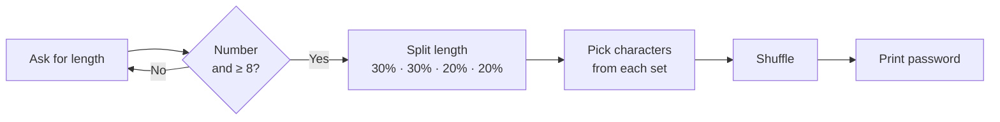

# Password Generator


A command-line password generator in Python. It asks for a length, validates the input, and builds a password that always mixes lowercase and uppercase letters, digits and symbols, in random order.

---

## How it works



1. **Input validation.** The user enters a length. Non-numeric input and values below 8 are rejected, and the user is asked again.
2. **Composition.** The length is split across four character sets, so every password contains all four types:

   | Character set | Share | Example characters |
   |---|---|---|
   | Lowercase letters | 30% | `a`–`z` |
   | Uppercase letters | 30% | `A`–`Z` |
   | Digits | 20% | `0`–`9` |
   | Symbols | 20% | `! # $ % & * @ ...` |

3. **Selection.** Each character set is shuffled and the first characters are taken, so no character repeats within a set.
4. **Final shuffle.** The selected characters are shuffled together, so the types are not grouped in a predictable order.

### Example

```
How many characters do you want in your password? abc
Please, Enter numbers only.
How many characters do you want in your password? 5
Your number should be at least 8.
Please, Enter your number again: 16
Strong Password:  U9dOT0J};8vRcb<y
```

---

## Getting started

Requires Python 3 and nothing else; the script uses only the standard library.

```bash
git clone https://github.com/JRBaiao/Password-Generator.git
cd Password-Generator
python "Password Generator/main.py"
```

---

## Security notes

Building a password generator raises questions that matter in any security context:

**Which random generator?** This version uses Python's `random` module, which is designed for simulations, not security. Its output can be predicted by an attacker who observes enough values. The [Python documentation](https://docs.python.org/3/library/random.html) recommends the `secrets` module for passwords and other security-sensitive values, as it draws from the operating system's cryptographically secure source.

**How strong is the result?** Strength is measured in *entropy*: the number of guesses an attacker would need. A 16-character password from this generator has about **95 bits** of entropy. A fully random 16-character password over the same 94 characters would have about **105 bits**. The difference comes from the fixed composition and from never repeating a character within a set, which both reduce the number of possible passwords. Both values are far beyond what brute force can reach; the choice of random generator matters much more.

**Length beats complexity.** Current guidance from [NIST SP 800-63B](https://pages.nist.gov/800-63-4/sp800-63b.html) puts length ahead of composition rules. Each extra character adds more strength than forcing a specific mix of character types.

---

## Limitations

- **Not cryptographically secure**, as explained above.
- **Lengths can be off by one.** The 30/20 split is rounded, so some lengths give a slightly different result. For example, asking for 9 characters returns 10, and 11 returns 10.
- **Maximum length of 52.** Because characters don't repeat within a set and there are only 10 digits, asking for 53 or more characters causes an error.
- **One password per run**, with no options for excluding symbols or similar-looking characters such as `l`, `1` and `I`.

## Roadmap

- Switch to the `secrets` module
- Generate exactly the requested length, with any remainder filled from all character sets
- Allow repeated characters, which removes the length limit and increases entropy
- Show the entropy of each generated password
- Add options to exclude symbols or ambiguous characters
- Add a passphrase mode that combines random words, which is easier to remember at the same strength
