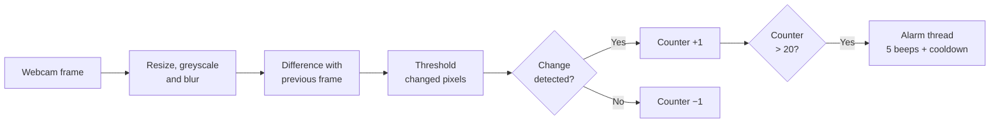

# Motion Detection Alarm


A webcam motion detector with an audible alarm. When alarm mode is armed, the program compares consecutive video frames, and if movement persists for long enough, it plays an alarm sound. Detection runs entirely on the local machine and nothing is recorded or stored.

---

## How it works



1. **Preprocessing.** Each frame is resized to 500 pixels wide, converted to greyscale and blurred. Blurring smooths out camera noise so that tiny pixel fluctuations are not mistaken for movement.
2. **Frame differencing.** The current frame is subtracted from the previous one. Pixels whose brightness changed by more than 25 (on a 0–255 scale) are marked white; everything else is black.
3. **Persistence counter.** A frame with changed pixels adds 1 to a counter; a still frame subtracts 1. This filters out brief flickers: the alarm only fires when movement is sustained across many frames.
4. **Alarm.** Once the counter passes 20, a background thread plays the alarm five times, one second apart, then waits five seconds before it can trigger again. Running the alarm in a separate thread keeps the video feed responsive.

While armed, the window shows the thresholded difference image, so you can see exactly which pixels the detector considers to be moving.

---

## Getting started

### Prerequisites

- Python 3
- A webcam

### Installation

```bash
git clone https://github.com/JRBaiao/Motion-Detection-System-.git
cd Motion-Detection-System-
pip install -r requirements.txt
```

### Run

Run the script from the project folder, so that it can find `alarm.wav`:

```bash
python main.py
```

### Controls

| Key | Action |
|---|---|
| `t` | Arm or disarm the alarm |
| `q` | Quit |

When the program starts, the alarm is disarmed and the window shows the normal camera view. Press `t` to arm it.

---

## Configuration

The detection behaviour is controlled by a few values in `main.py`:

| Setting | Value | Effect |
|---|---|---|
| Pixel change threshold | `25` | How much a pixel's brightness must change to count as movement |
| Motion threshold | `threshold.sum() > 10` | How much changed area is needed for a frame to count as motion |
| Persistence | `alarm_counter > 20` | How many net motion frames trigger the alarm |
| Blur kernel | `(5, 5)` | Larger values ignore smaller movements and noise |
| Beeps / cooldown | `5` / `5 s` | Alarm length and pause before it can trigger again |

---

## Project structure

```
├── main.py      # Capture, detection loop and alarm
├── alarm.wav    # Alarm sound
└── requirements.txt
```

---

## Limitations

- **Very high sensitivity.** In the thresholded image, each changed pixel has a value of 255, so `threshold.sum() > 10` is true as soon as a single pixel changes. Camera noise or a small change in lighting can therefore count as motion. A threshold based on the *number* of changed pixels, for example `cv2.countNonZero(threshold) > 500`, gives far more control.
- **Lighting changes look like motion.** Frame differencing reacts to any change in brightness, so a light switching on or a cloud passing can trigger the alarm.
- **No location or recording.** The detector knows *that* something moved, but does not mark where, and saves no images or log of events.
- **No camera check.** If the webcam is unavailable, the program fails with an error instead of a clear message.

## Roadmap

- Replace the pixel-sum check with a minimum moving area, and draw bounding boxes around moving objects using contours
- Use background subtraction (`cv2.createBackgroundSubtractorMOG2`) to cope better with gradual lighting changes
- Log timestamped motion events, with optional snapshots
- Add a check that the camera opened successfully

### Privacy by design

Because the current version records nothing, it raises no data retention questions. If snapshot or video saving is added, footage of people becomes personal data under the GDPR. A responsible design would then need a clear purpose, limited retention, secure storage and signage where others could be filmed, and the roadmap above should be implemented with those requirements in mind.
